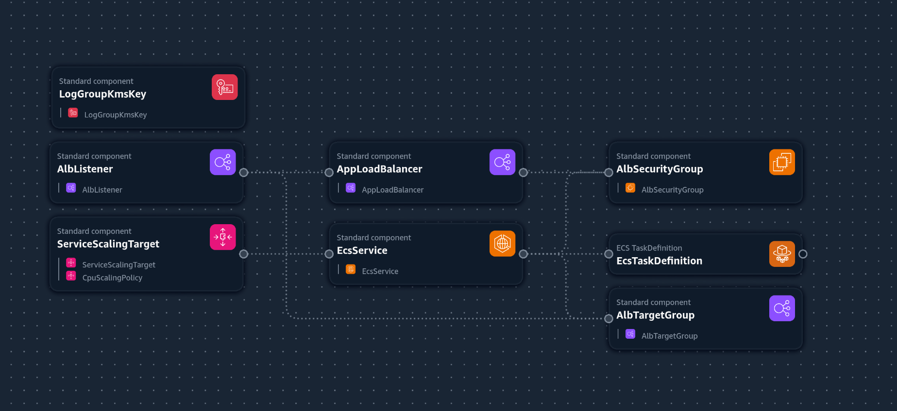
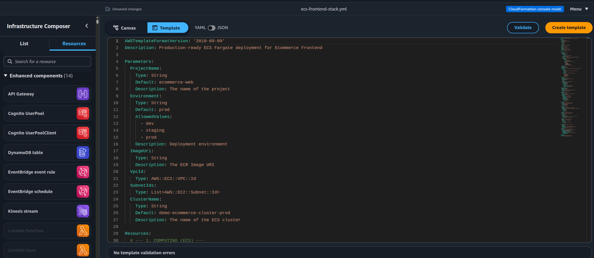
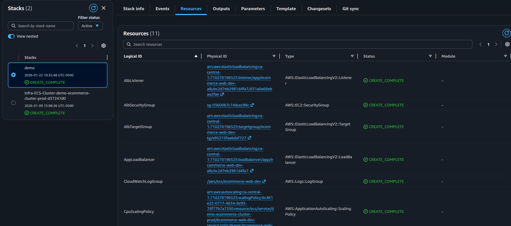

# Production-Grade Scalable Ecommerce Frontend

This repository contains a containerized React application architected for high availability and automatic horizontal scaling using AWS ECS Fargate.

## Architecture Summary

This infrastructure is designed to handle production-level traffic while minimizing manual intervention and cost.

- **Infrastructure as Code (IaC):** Managed via AWS CloudFormation for repeatable deployments.
- **Compute:** AWS Fargate (Serverless) providing isolated, managed execution environments.
- **Load Balancing:** Application Load Balancer (ALB) distributing traffic across multiple Availability Zones.
- **Elasticity:** Automated Target Tracking scaling based on real-time CPU utilization.
- **Logging:** Centralized CloudWatch Logs for Nginx and application monitoring.

## CloudFormation Template

The infrastructure is defined using AWS CloudFormation, which can be viewed and edited in AWS Infrastructure Composer:

## Deployment

After deploying the stack, all resources will show `CREATE_COMPLETE` status in the CloudFormation console:

